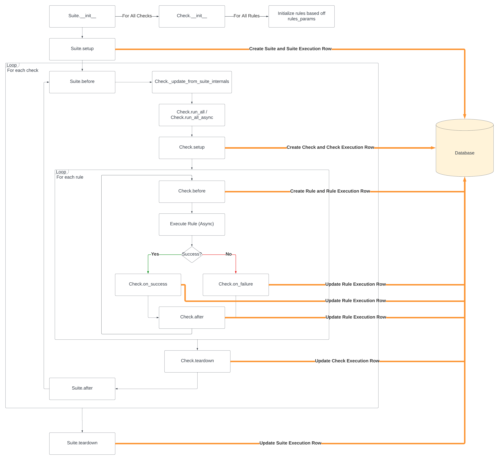

# data_checks 
  

**Program and execute any data quality checks.**

## Overview
Exisiting data observability solutions are painfully static. data_checks provides a dynamic data observability framework that allows you to program and execute any data quality checks. Inspired by Python's [unittest](https://docs.python.org/3/library/unittest.html) approach to writing unittests, data_checks allows you to write data quality checks as easily and seamlessly as you would write unittests on your code.

Some reason you might use this library:
- Use existing Python functions in data checks
- Greater control over how data checks are defined and executed
- Infinitely extendible and customizable for any data quality use case
- Built-in async execution of data checks
- Connect any database to store data related to checks and executions
- **[WIP]** Define before, after, on success and on failure actions based on data checks
- **[WIP]** Automatically generate data checks from the command line (as you would generate a database migration) and Jupyter Notebooks

## Architecture
This library defines 3 core concepts: suites, checks, and rules. Suites are a collection of checks and/or rules. Checks are groups of organized rules that can be selectively executed. Rule are the atomic unit of this data check library and consist of functions that run a series of assertions on incoming data. **In the current version, rules need to be defined within checks. This will be changed in a later version of the library.** Rules are the fundamental building block of data checks — every other component in this library is built on top of rules and adds additional functionality around these checks. Furthermore note that a Dataset defined in a suite and/or check can be accessed by its children rules.


The execution flow of a suite of data checks goes as follows:



### 0. Instantiate the Database
Before importing the data_checks library, you need to instantiate the database. This database will be used to store information about the checks and their executions. The database can be any database supported by SQLAlchemy. In this example, we will use a PostgreSQL database. Inside our data checks repository (`data_quality/`) define a `__init__.py` file and instantiate the database as follows:

```python


<!-- ```python
from data_checks import Suite -->
## Features
### Suites
### Checks
### Rules
### Dataset
### Database
### Data Check Exceptions
## Requirements
- Python 3.6+
- SQLAlchemy 2.0+
- typing_extensions 4.7+
## Installation
```shell 
pip install -i https://test.pypi.org/simple/ data-checks -U
```

### Warning
- This library is still in beta and is subject to change.
- Async running issues with database and open files